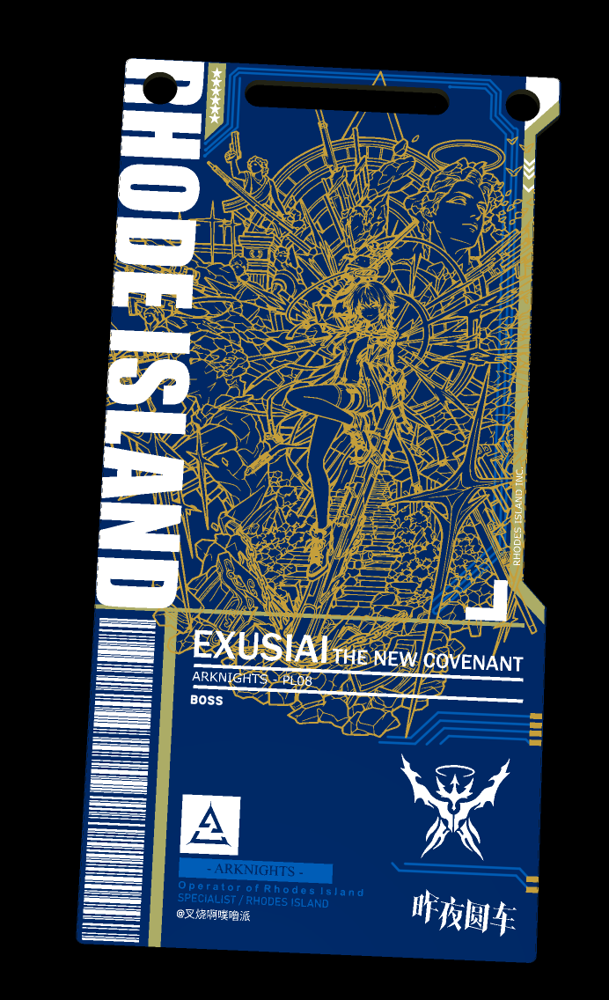
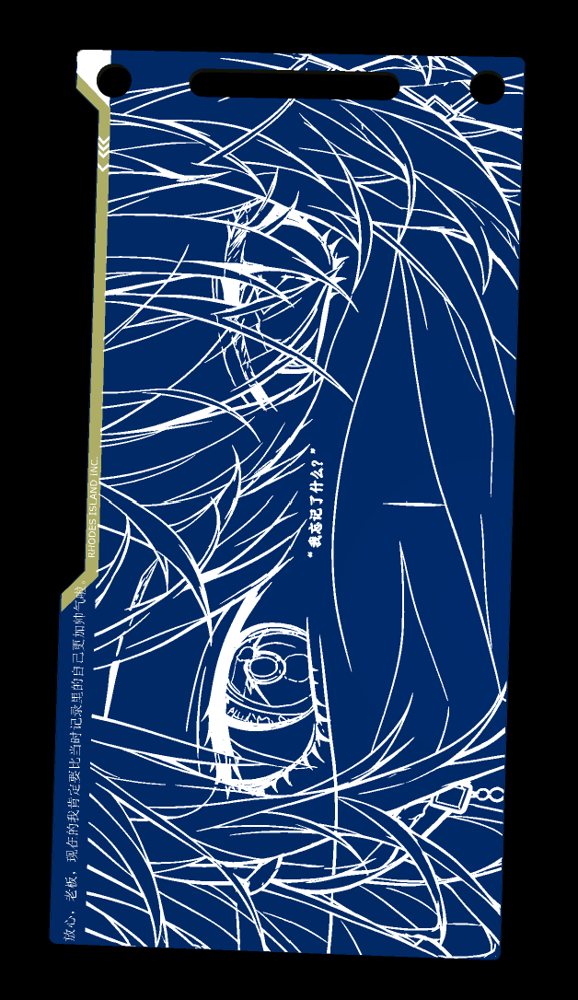

# 明日方舟干员通行证 PCB

## 项目介绍

本项目是以《明日方舟》角色 **「新约能天使」** 为主题的个人非官方同人创作，将角色立绘、名称、职业与阵营元素组合为装饰性双面 PCB 通行证设计，并整理了相关工程、图片素材和制作记录。

**创作的出发点仅仅是个人对该角色的喜爱，希望用 PCB 这一载体记录和表达这份喜爱，满足个人欣赏、收藏及设计学习的兴趣。项目不以商业经营、商品销售、承接订单或获取任何直接、间接经济利益为目的。**

> **非官方 · 未获鹰角网络授权 · 禁止商业及其他获利用途**  
> 本项目不是官方商品或官方合作项目。“通行证”仅为外观设计主题，不具有身份认证、门禁、活动入场或其他真实凭证功能；本项目也不是以实现电子电路功能为目的的电路产品。

## 使用的工具与素材来源

| 工具或来源 | 在本项目中的作用 |
| --- | --- |
| 嘉立创 EDA 专业版 | PCB 板面设计、图层与文字排版、工程管理、三维效果预览及制板数据输出。 |
| ChatGPT | 辅助角色立绘的黑白线稿处理与表达。处理结果不改变原素材的权利归属。 |
| [银杏的码工坊](银杏的码工坊.html) | 项目配套的 HTML 工具，支持二维码与 Code 128 条形码生成及图片输出；本项目中的条形码用于装饰性设计。 |
| [PRTS Wiki](https://prts.wiki/) | 干员立绘、职业与阵营图标等资料的参考来源。PRTS 为资料来源，不代表其能够替原始权利人授予素材许可。 |
| 《明日方舟》相关立绘与宣传影像 | 角色形象、背面图案及视觉元素的参考素材。相关原始内容归各自权利人所有。 |
| 嘉立创 PCB 服务 | 制板文件与工艺说明涉及的第三方生产服务平台；不代表本项目已获得平台或版权方认可，也不构成已完成实物生产的证明。 |

上述名称用于说明项目所涉及的工具、平台和资料来源，不表示与相关主体存在合作、赞助、代言或授权关系。

## 项目内容与成果

- **双面通行证设计**：正面包含角色线稿、干员名称、职业与阵营标志及装饰条形码；背面采用相关主题图案形成整体视觉设计。
- **PCB 图层设计**：通过铜层、阻焊层与丝印层的图形组合表现图案与文字，并保留相应工程数据。
- **工程文件**：包含空白通行证模板，以及以新约能天使为主题的完成版设计工程。
- **制造数据示例**：包含从示例设计导出的 Gerber 文件。文件的存在不代表其已经通过制造审核或量产验证。
- **配套素材与工具**：包含立绘、黑白线稿、背面图案、职业与阵营图标，以及网页条码工具。
- **制作记录**：原始图文文档与截图记录了设计过程，独立于本页的项目介绍。

### 设计预览

下图为编辑器生成的三维设计预览，**不是实物照片**。颜色、金属质感、线条细节与最终实物可能存在差异。

| 正面设计预览 | 背面设计预览 |
| --- | --- |
|  |  |

### 文件组成

| 文件或目录 | 内容 |
| --- | --- |
| [空白板子.eprj2](空白板子.eprj2) | 嘉立创 EDA 专业版单文件工程格式的空白通行证模板。 |
| [新约能天使PCB板.eprj2](新约能天使PCB板.eprj2) | 新约能天使主题的完成版 PCB 设计工程。 |
| [Gerber_新约能天使通行证_2026-09-29.zip](Gerber_新约能天使通行证_2026-09-29.zip) | 对应示例设计的 Gerber 制板数据。 |
| [立绘_新约能天使_2_彩绘.png](立绘_新约能天使_2_彩绘.png) | 角色立绘参考素材。 |
| [新约能天使精二立绘_黑白线稿.png](新约能天使精二立绘_黑白线稿.png) | 本项目使用的角色黑白线稿。 |
| [背板图片.png](背板图片.png)、[昨夜圆车.png](昨夜圆车.png) | 背面及其他视觉设计参考素材。 |
| [明日方舟_众生行记_活动先导PV_.mp4](明日方舟_众生行记_活动先导PV_.mp4) | 相关宣传影像参考文件。 |
| [职业图标](职业图标)、[阵营图标_白底黑字](阵营图标_白底黑字) | 职业及阵营图标素材。 |
| [银杏的码工坊.html](银杏的码工坊.html) | 配套网页二维码与条形码工具。 |
| [罗德岛机密文件.pdf](罗德岛机密文件.pdf)、[docs/images](docs/images) | 独立的原始图文制作记录与项目截图。 |

## 版权、非商业使用与免责声明

### 创作目的与非官方性质

本项目仅源于作者个人对《明日方舟》及新约能天使这一角色的喜爱，是个人兴趣驱动的设计实践与同人表达。作者希望记录角色主题设计的成果，不以此开展经营活动，不借相关角色、品牌或作品的影响力谋取经济利益。

**本项目未获得上海鹰角网络科技有限公司及其相关主体的授权、许可、合作、赞助或认可。**项目中的角色表现、文字说明、设计选择及其他表达均不代表鹰角网络、《明日方舟》官方或其他权利人的立场。

本项目及其衍生展示不得被描述为“官方制作”“官方授权”“官方联名”“官方周边”“官方认证”或其他足以使公众产生同类误解的内容。使用相关名称、图案和标志，也不意味着具有官方身份、合作关系或商标使用许可。

### 知识产权与素材归属

《明日方舟》的角色形象、角色名称、立绘、职业与阵营标志、世界观设定、宣传影像、美术作品及其他受保护内容，其知识产权属于鹰角网络或相应合法权利人。第三方软件、字体、图片、商标、界面与其他材料的权利，分别归各自权利人所有。

本项目对素材进行截取、线稿化、反相、排版、格式转换、AI 辅助处理或 PCB 图层表达，不改变原作品的权利归属，也不使作者当然取得对原作品的完整著作权、商业使用权或转授权权利。作者仅能对自己独立创作且依法享有权利的部分作出相应使用安排。

仓库中的文件能够被访问或下载，不等于这些文件已取得公开传播、改编、再分发或商业使用所需的全部授权；来源网站可公开访问也不等于素材处于公有领域。

### 明确禁止商业及其他获利用途

**本项目不提供商业使用许可。不得将本项目的角色主题设计、工程、Gerber、素材组合、说明文档或由其直接、间接衍生的作品及实物，用于商业经营或者其他直接、间接获利用途。**独立第三方组件的既有许可边界，见下文“第三方软件与独立许可”。

禁止的用途包括但不限于：

- **出售文件或实物**：销售、付费下载、有偿转让工程、制板数据、素材包、教程、成品或半成品；以数字商品、实体周边或授权包形式交易。
- **承接有偿服务**：利用本项目接单设计、收费改图、定制角色通行证、代下单、代制作、代加工、代销售，或者收取设计费、服务费、加工差价及佣金。
- **组织商业生产与分销**：预售、众筹、团购、批量备货、批发、代理、分销、寄售，以及通过网店、社交平台、展会、同人活动或其他渠道经营相关商品。
- **以付费权益变相提供内容**：将文件、教程、成品或取得这些内容的资格作为会员、付费社群、付费课程、付费咨询、订阅服务或其他付费项目的权益。
- **捆绑销售与商业赠品**：随收费商品或服务赠送，作为促销奖品、消费满赠、付费抽奖奖品、商业宣传物料，或者用“赠品免费、其他项目收费”的方式转移对价。
- **广告、推广及流量变现**：将本项目作为广告、带货、商业直播、推广合作、店铺引流、获客或其他经营活动的素材，并据此取得广告收入、平台分成、佣金、商业线索或其他经济利益。
- **与项目挂钩的赞助和付费支持**：以本项目及其衍生内容为理由或回报获取赞助、打赏、捐赠、众筹资金、实物报酬等，或以付款、赞助、打赏为取得内容、定制服务或实物的条件。
- **再次授权或资产化经营**：将本项目内容作为可经营的素材、设计资产、品牌资产或数字藏品提供给他人，收取许可费、使用费或其他报酬。

**上述限制不以是否实现净利润为唯一判断标准。**“成本价”“零利润”“只收材料费”“只收邮费”“代购”“拼单”“交流费用”“自愿支持”等称谓，本身不能使商业交易或变相收费符合本项目的使用边界；经营者亏损、单次交易金额较小、通过第三方收款或由他人代为销售，也不当然改变行为性质。

对设计作局部修改、替换角色、改变颜色或文件格式、删去项目名称、加入自己的标识、重新打包或与其他内容组合，同样不能仅据此规避对本项目受保护内容的使用限制。但本声明不据此主张控制与本项目无关、且他人依法独立创作的作品。

### 个人使用、制作费用与非商业边界

本项目所表达的个人使用意图，是在依法允许或取得必要授权的范围内，供个人欣赏、收藏、学习及非商业交流；**这不是对所有此类行为作出的合法性保证，也不是代替原始权利人发出的许可。**

个人为自己依法开展的制作活动支付正常的材料费、加工费及运输费，不等于个人通过本项目获利；这一说明仅用于区分个人支出与商业经营，不构成对素材复制、委托制造、厂商承接加工或成品销售的授权，也不允许以个人制作名义经营代制或销售业务。

免费赠送、免费展示、免费分发、非营利组织使用或公益用途，都不当然意味着无需授权。个人之间的无偿交流同样应尊重第三方权利，不得借交流之名开展营销、收费、批量分发或其他经营活动。

作者无权批准他人商业使用鹰角网络及其他权利人的内容。任何拟超出本声明边界的用途，均不能以仓库公开、作者默许、未收到投诉或第三方口头认可作为授权依据；确需许可的，应由实际权利人依法作出。

### 转载、修改与衍生成果

公开展示、转载、分享、Fork、镜像保存或二次创作，可能涉及原作品与项目原创部分的不同权利。本声明不因项目非商业而自动授予上述行为所需的全部许可。

在具有合法依据开展相关使用时，应保留适用的来源说明、版权标识、第三方许可及本项目的非官方和非商业说明；修改版应明确标注已作修改，避免使他人误认为是本项目作者或官方发布的版本。注明出处本身不能替代必要授权。

不得通过删除免责声明、混淆来源、冒用作者或官方身份、宣称完整原创、声称独占角色素材等方式误导他人；不得将本项目提供的文件作为自己已取得商业使用权、生产资格或官方认可的证明。

### 第三方软件与独立许可

嘉立创 EDA、嘉立创 PCB、PRTS、GitHub、ChatGPT、Codex 及其他被提及的工具或平台，均由其各自运营主体提供，与本项目相互独立。项目中对工具的提及不构成其对本项目的审查、推荐或担保。

配套网页工具包含的 `node-qrcode`、`JsBarcode` 等第三方组件，适用各自的许可。**本项目的非商业声明不撤销、缩减或取代第三方组件原有许可授予的权利，例如 MIT 许可对相应组件允许的商业使用权。**这些组件的许可也不反向授予使用《明日方舟》素材或本项目角色主题设计的权利。

本仓库不将全部文件统一宣称为可自由商用的开源内容。软件组件、项目原创内容与第三方角色素材的权利应分别判断，不能仅凭仓库公开或某一组件采用开放许可，推定所有内容适用相同许可。

### 技术说明与责任范围

本项目的工程、图形、制板数据、工具及文档按现有状态提供，主要用于记录个人设计成果；不保证不存在错误、不保证适配所有软件版本或制造工艺，也不保证成品外观、强度、可靠性、条码识读效果或特定用途的适用性。

预览图片与实际成品可能存在颜色、尺寸表现、线宽、丝印、金属质感及工艺差异。文件中出现品牌标识、条形码或二维码，不代表具有官方验证、溯源或身份识别能力。第三方服务的可用性、价格、优惠活动及页面内容可能变化，相关记录不构成服务承诺。

涉及第三方生产、付款、运输及其他服务的权利义务，由实际交易关系和适用法律确定。本声明不替任何平台或制造商作出承诺，也不通过“一切责任由使用者承担”等概括表述免除作者依法应承担的责任；依法不得排除或限制的责任不受本声明影响。

### 权利异议与内容处理

如权利人认为本项目内容侵犯其合法权益，可通过仓库实际提供的联系渠道向维护者说明相关文件位置、权利依据及诉求。公开渠道不宜提交身份证件、私人联系方式等敏感资料；必要的核验信息可通过双方确认的适当渠道提供。

维护者将在了解情况后依法核实，并视情况采取删除、替换、补充标注、限制访问或停止提供相关内容等措施。联系维护者不是权利人依法寻求救济的前置条件，处理争议也不意味着对历史行为的追认、授权或当然免责。

对公开文件的修改或删除，不保证自动同步到其他人的 Fork、镜像、下载副本、平台缓存或历史记录。维护者对自身可控制的内容依法处理，并在合理范围内配合相关处理请求，不承诺能够撤回所有第三方副本。

### 声明效力与法律边界

本声明表达创作目的、项目使用限制与相关责任边界，**不构成鹰角网络或其他权利人的授权，不构成侵权免责承诺，也不能保证任何使用行为必然合法。**个人喜爱角色、没有收费、没有盈利、注明出处或写有免责声明，均不能单独替代法律要求的授权或其他合法依据。

[《中华人民共和国著作权法》](https://www.ncac.gov.cn/xxfb/flfg/flfg_532/202103/t20210309_50530.html)第十条规定了复制、改编、信息网络传播等权利；第二十四条中的有关使用例外有适用条件，不能将“个人学习、研究或者欣赏”直接扩大为对完整素材公开上传、分发或经营的普遍许可。鹰角网络相关条款可参阅[《鹰角网络游戏使用许可及服务协议》](https://user.hypergryph.com/protocol/plain/ak/service)；该协议中的个人使用安排不能直接理解为对本项目公开传播或制售衍生品的授权。

本声明仅在作者依法能够决定的权利范围内设定项目使用限制，不限制法定权利、合法取得的独立许可或依法不得限制的行为。具体行为的法律评价以适用法律、有效授权及实际事实为准；本声明不替代专业法律意见。个别表述如不适用或不具有相应效力，不因此扩大本项目授予的权利范围。

**再次强调：本项目只为表达作者对新约能天使的个人喜爱而创作，未获鹰角网络授权，不提供商业许可，禁止用于商业经营及其他直接、间接获利用途。**
